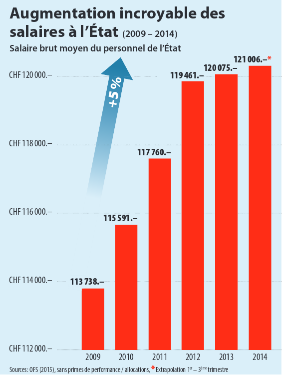
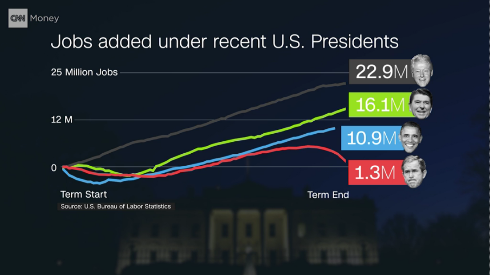
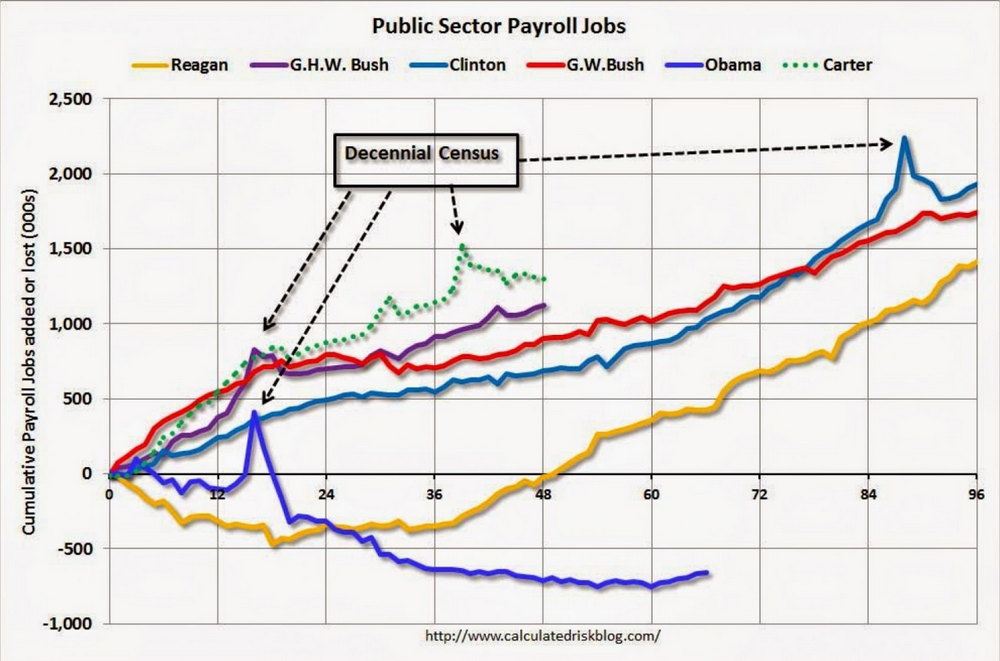

#Example 1: Figure from the UDC program

The figure on the left was published in the UDC (Union démocratique du centre) [2015-2019 political program](http://www.udc-ne.ch/DIVERS/Programme_2015-2019.pdf). It shows the evolution of the average salary for state employees.

```{r, figure1, echo=F,out.height="300px", out.width = "300px"}


library(ggplot2)
options(scipen=999)
state_sal <- data.frame(year = as.character(seq(2009,2014)), salaries= c(113738, 115591, 117760, 119461, 120075, 121006))
ggplot(data=state_sal)+
  geom_bar(aes(x=year,y=salaries,fill="red"),stat = "identity")+
  theme_classic()+ggtitle("Augmentation incroyable des salaires de l'état")+
  annotate(x=state_sal$year,y=state_sal$salaries+5000,geom="text",label=paste0(state_sal$salaries,".-"))+
  ylab("Salaire moyen")+xlab("Année")+guides(fill=FALSE)

```

The title ("Incredible increase in state salaries") makes it obvious that the purpose of this graph is to prove that those salaries increased in the recent years. The steep slope indeed gives this impression, however taking a closer look at the Y axis scale reveals it is truncated and only spans from  112,000 to 120'000 CHF.

The rescaled graph (right) gives a very different impression. Proportionally to the salaries, the increase looks much less significant.


 
#Example 2: Jobs creation under Obama

Here are 2 figures illustrating the number of jobs added in the US under different presidencies. The first one was used in a [CNN video](http://money.cnn.com/video/news/economy/2016/11/04/obama-jobs-record.cnnmoney/index.html?iid=V_Top) and measures the total number of jobs added under each president. The second one was published in a [Washington Post article](https://www.washingtonpost.com/news/fact-checker/wp/2014/09/15/obamas-claim-that-businesses-are-in-the-longest-uninterrupted-stretch-of-job-creation/#comments) and focuses on the jobs created in the public sector. 


```{r, figure2a, echo=F,out.height="400px", out.width = "400px"}



```

```{r, figure2b, echo=F,out.height="400px", out.width = "400px"}


```

It is interesting to note that, although both figures are correct and measure two different things, they could be used to convey opposite messages to the unaware reader: When considering all sectors, It appears the number of jobs increased under the Obama presidency. When focusing on the public sector, however Obama is the only president with a negative job creation.

Unlike the CNN video, the article from the Washington Post warns against such comparisons, stating that there are many other important factors affecting job creation more than policies issued by the president. This example shows that plotting only a subset of the same data can give a totally different view of the same situation and that understanding the background is important for a proper interpretation.
